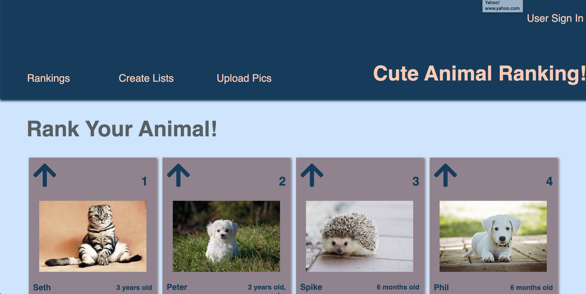
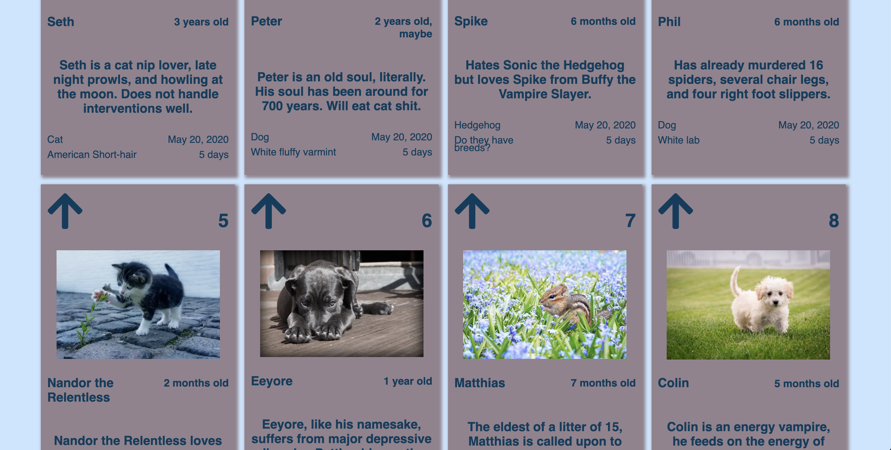
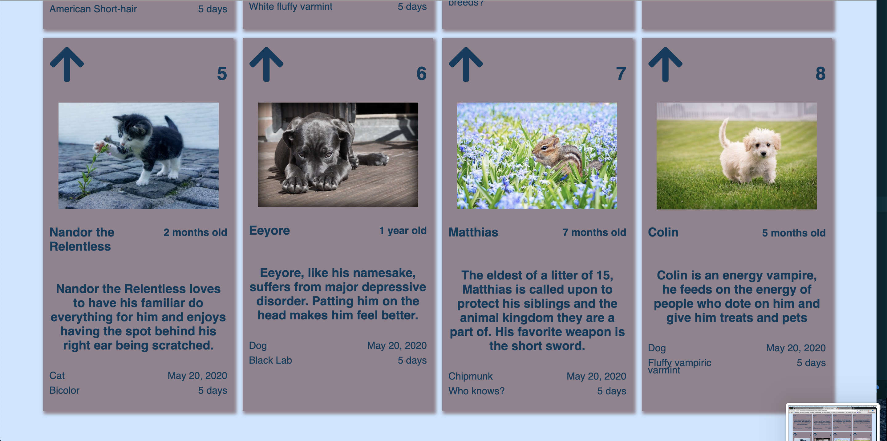

# Project Overview:

In this project, we were tasked with replicating a screenshot of a website, though we had some flexibility with the content of our replication.

I created a cute animal ranking site. The top navigation bar includes a place for users to sign in, and links for additional functionality (rankings, adding your own animals, and making your own lists). Each card has a picture of an animal, a place to upvote an animal, their current ranking, and some information about the animal.

Below is website we had to replicate:

Here are two screenshots of my website recreation:

Links to the images used for the animals:
Image by <a href="https://pixabay.com/users/Kirgiz03-6995361/?utm_source=link-attribution&amp;utm_medium=referral&amp;utm_campaign=image&amp;utm_content=2934720">Юрий Сидоренко</a> from <a href="https://pixabay.com/?utm_source=link-attribution&amp;utm_medium=referral&amp;utm_campaign=image&amp;utm_content=2934720">Pixabay</a>

Image by <a href="https://pixabay.com/photos/?utm_source=link-attribution&amp;utm_medium=referral&amp;utm_campaign=image&amp;utm_content=801826">Free-Photos</a> from <a href="https://pixabay.com/?utm_source=link-attribution&amp;utm_medium=referral&amp;utm_campaign=image&amp;utm_content=801826">Pixabay</a>

Image by <a href="https://pixabay.com/users/3194556-3194556/?utm_source=link-attribution&amp;utm_medium=referral&amp;utm_campaign=image&amp;utm_content=1903313">Karen Warfel</a> from <a href="https://pixabay.com/?utm_source=link-attribution&amp;utm_medium=referral&amp;utm_campaign=image&amp;utm_content=1903313">Pixabay</a>

Image by <a href="https://pixabay.com/users/amayaeguizabal-151412/?utm_source=link-attribution&amp;utm_medium=referral&amp;utm_campaign=image&amp;utm_content=1215140">Amaya Eguizábal</a> from <a href="https://pixabay.com/?utm_source=link-attribution&amp;utm_medium=referral&amp;utm_campaign=image&amp;utm_content=1215140">Pixabay</a>

Image by <a href="https://pixabay.com/users/Dimhou-5987327/?utm_source=link-attribution&amp;utm_medium=referral&amp;utm_campaign=image&amp;utm_content=2536662">Dimitri Houtteman</a> from <a href="https://pixabay.com/?utm_source=link-attribution&amp;utm_medium=referral&amp;utm_campaign=image&amp;utm_content=2536662">Pixabay</a>

Image by <a href="https://pixabay.com/users/Winsker-31470/?utm_source=link-attribution&amp;utm_medium=referral&amp;utm_campaign=image&amp;utm_content=423398">Winsker</a> from <a href="https://pixabay.com/?utm_source=link-attribution&amp;utm_medium=referral&amp;utm_campaign=image&amp;utm_content=423398">Pixabay</a>

Image by <a href="https://pixabay.com/users/JillWellington-334088/?utm_source=link-attribution&amp;utm_medium=referral&amp;utm_campaign=image&amp;utm_content=2323827">Jill Wellington</a> from <a href="https://pixabay.com/?utm_source=link-attribution&amp;utm_medium=referral&amp;utm_campaign=image&amp;utm_content=2323827">Pixabay</a>

Image by <a href="https://pixabay.com/users/Pezibear-526143/?utm_source=link-attribution&amp;utm_medium=referral&amp;utm_campaign=image&amp;utm_content=1123016">Pezibear</a> from <a href="https://pixabay.com/?utm_source=link-attribution&amp;utm_medium=referral&amp;utm_campaign=image&amp;utm_content=1123016">Pixabay</a>
